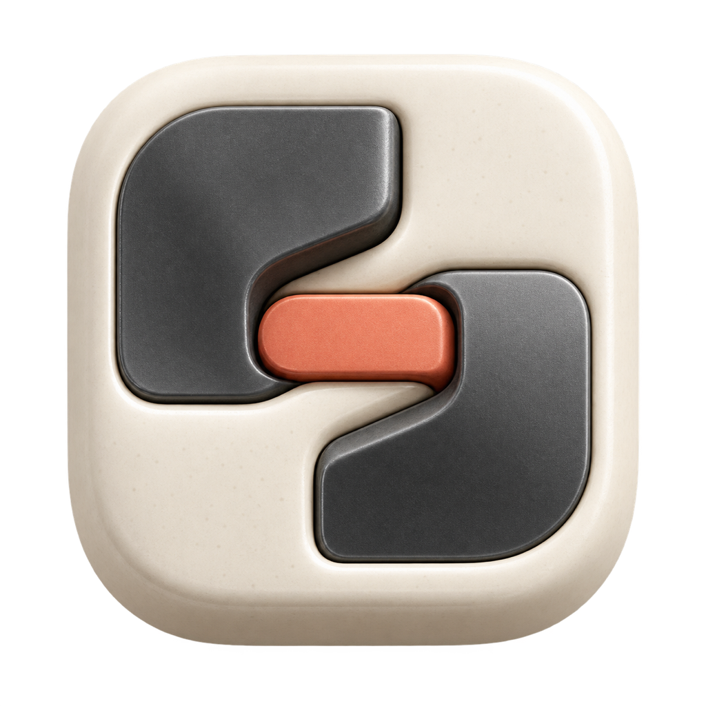
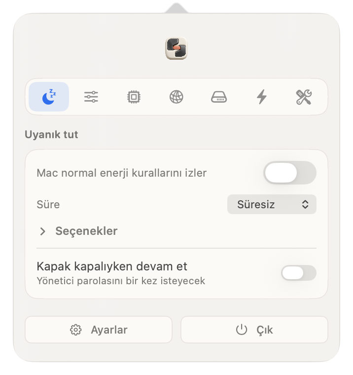
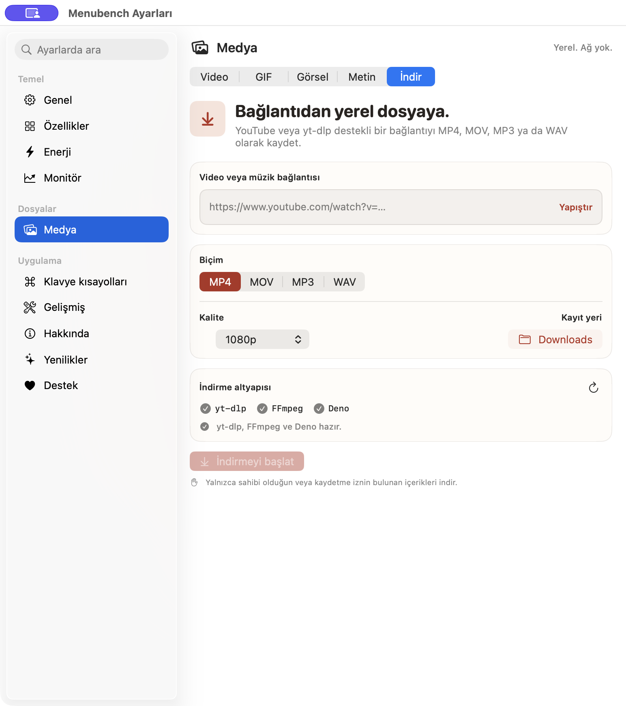
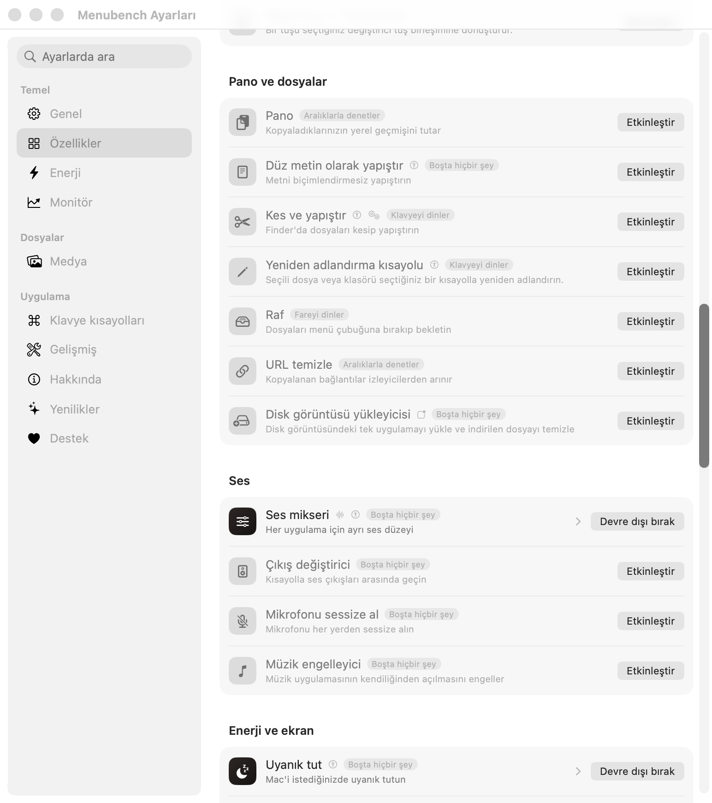

<!-- Hallmark · modern-minimal · soft technical premium · cream/graphite/terracotta · macrostructure: Workbench · pre-emit critique: P5 H5 E5 S5 R5 V4 · slop: pass -->

<p align="center">
  
</p>

<h1 align="center">Menubench</h1>

<p align="center">
  <strong>Small Mac tools, kept within reach.</strong><br>
  A local-first menu bar workbench for monitoring, media, windows and everyday tasks.
</p>

<p align="center">
  <a href="https://github.com/augrclk/menubench/releases/latest/download/Menubench.dmg"><strong>Download Menubench.dmg</strong></a>
  &nbsp;&nbsp;·&nbsp;&nbsp;
  <a href="#homebrew">Install with Homebrew</a>
  &nbsp;&nbsp;·&nbsp;&nbsp;
  <a href="docs/PRIVACY.md">Read the privacy notes</a>
</p>

<p align="center"><sub>macOS 14 Sonoma or newer · Apple silicon and Intel · GPL-3.0-or-later</sub></p>

<br>

<p align="center">
  
</p>

Menubench keeps frequently used controls behind one menu bar icon. Start with a quiet system readout and a keep-awake switch; enable more tools only when they earn their place. Every module ships with the app—the feature screen controls what is active, not what is installed.

## Save a link in the format you need

The built-in downloader accepts YouTube and other `yt-dlp`-supported links. Choose MP4 or MOV for video, MP3 or WAV for audio, select the quality and save the result directly to your Mac.

<p align="center">
  
</p>

`yt-dlp`, FFmpeg and Deno run locally. The URL is passed as a direct process argument rather than through a shell. Use the downloader only for media you own or have permission to save.

## Keep the bench as small as you like

<p align="center">
  
</p>

The feature screen is an activity map, not an installer. Disabling a module removes it from the interface and stops its background work. Re-enable it at any time.

| Area | Included tools |
|---|---|
| **Monitor** | Real CPU, GPU, memory, disk, network, battery, temperature and fan readings; history graphs; transfer-based network quality testing. |
| **Windows** | Snapping, visual app switching, Dock previews, focus helpers and configurable shortcuts. |
| **Media** | Link downloads, local video conversion, GIF creation, image tools, OCR, screenshots and screen recording. |
| **Audio** | Per-app volume, output routing, device switching, input pinning and global microphone mute. |
| **Files** | Clipboard history, snippets, a temporary shelf, Finder cut-and-paste, DMG installation and app cleanup. |
| **Menu bar** | Reorderable sections, optional live readings, compact controls and independent appearance settings. |

## Install

Download [Menubench.dmg](https://github.com/augrclk/menubench/releases/latest/download/Menubench.dmg), open it and drag **Menubench** to **Applications**. Public releases are signed with an Apple Developer ID. Apple notarization is required by the release workflow before a production asset is published.

### Homebrew

This repository is also a Homebrew tap. The Cask installs Menubench together with the downloader dependencies.

```sh
brew tap augrclk/menubench https://github.com/augrclk/menubench
brew install --cask augrclk/menubench/menubench
```

Update or remove it later:

```sh
brew upgrade --cask augrclk/menubench/menubench
brew uninstall --cask menubench
```

## Private by default

Menubench has no account, advertising, analytics or telemetry. Most tools stay entirely on your Mac. Network access occurs only when the chosen action requires it—for example a download, speed test, Homebrew action or update check.

Permissions are requested per feature and remain optional. See [Privacy](docs/PRIVACY.md) and [Permissions](docs/PERMISSIONS.md) for the complete behavior.

## Build with Xcode

Open [Menubench.xcodeproj](Menubench.xcodeproj), select your Development Team and run the shared **Menubench** scheme. The Release configuration produces a universal Apple silicon and Intel app.

Command-line development build:

```sh
git clone https://github.com/augrclk/menubench.git
cd menubench
brew install yt-dlp ffmpeg deno
./build.sh --dev
./build/MenubenchDeveloper --selftest
./build.sh --test
```

Signing, notarization and DMG publishing are documented in [DISTRIBUTION.md](DISTRIBUTION.md).

## Contributing

Focused fixes, new tools and translations are welcome. Read [CONTRIBUTING.md](CONTRIBUTING.md), open an issue and include the macOS version and hardware used for testing.

## License

Menubench is distributed under [GPL-3.0-or-later](LICENSE). Copyright and third-party notices are recorded in [NOTICE](NOTICE).

© 2026 Arif Uğur Çelik
