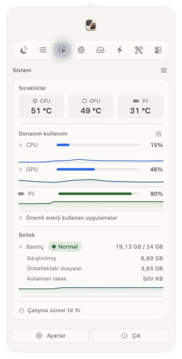
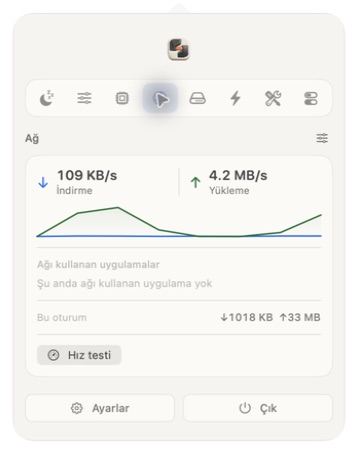

<!-- Hallmark · modern-minimal · soft technical premium · cream/graphite/terracotta · macrostructure: Workbench · enrichment: real Menubench product captures · pre-emit critique: P5 H5 E5 S5 R5 V5 · slop: pass -->


# Menubench

**One menu bar icon. The tools you actually use.**<br>
Tek menü çubuğu simgesi. Gerçekten kullandığınız araçlar.

System readings, media downloads, window controls and everyday Mac utilities—local first.<br>
Sistem ölçümleri, medya indirme, pencere yönetimi ve günlük Mac araçları—öncelikle yerel.

[**Download .dmg**](https://github.com/augrclk/menubench/releases/latest/download/Menubench.dmg) · [Homebrew](#homebrew) · [Privacy](docs/PRIVACY.md)<br>
[English](#english) · [Türkçe](#turkce)

<sub>macOS 14 Sonoma or newer · Apple silicon and Intel · GPL-3.0-or-later</sub>

<br>

<p align="center">
  
</p>

## Product tour · Ürün turu

### From a link to a local file · Bağlantıdan yerel dosyaya

Paste a supported link, choose MP4, MOV, MP3 or WAV, set the quality and save it directly to your Mac. Bağlantıyı yapıştırın; biçimi ve kaliteyi seçin; dosyayı doğrudan Mac’inize kaydedin.

<p align="center">
  
</p>

### Live readings you can verify · Doğrulayabileceğiniz canlı ölçümler

CPU, GPU, memory, battery, temperatures and network traffic come from macOS system data. The network test performs real transfers instead of presenting a decorative estimate.

CPU, GPU, bellek, pil, sıcaklık ve ağ verileri macOS sistem kaynaklarından alınır. Hız testi görsel bir tahmin göstermek yerine gerçek veri aktarımı gerçekleştirir.

<p align="center">
  
  
</p>

### Every tool is included · Tüm araçlar uygulamaya dahildir

The feature screen controls what appears and runs; it is not an installer. Disabling a module removes it from the interface and stops its background work. Özellik ekranı bir yükleyici değildir; yalnızca hangi araçların görünür ve etkin olacağını belirler.

<p align="center">
  
</p>

---

<a id="english"></a>

## English

Menubench keeps frequently used controls behind one menu bar icon. Start with a quiet system readout and a keep-awake switch; enable more tools only when they earn their place. Every module ships with the app—the feature screen controls what is active, not what is installed.

| Area | Included tools |
|---|---|
| **Monitor** | Real CPU, GPU, memory, disk, network, battery, temperature and fan readings; history graphs; transfer-based network quality testing. |
| **Windows** | Snapping, visual app switching, Dock previews, focus helpers and configurable shortcuts. |
| **Media** | Link downloads, local video conversion, GIF creation, image tools, OCR, screenshots and screen recording. |
| **Audio** | Per-app volume, output routing, device switching, input pinning and global microphone mute. |
| **Files** | Clipboard history, snippets, a temporary shelf, Finder cut-and-paste, DMG installation and app cleanup. |
| **Menu bar** | Reorderable sections, optional live readings, compact controls and independent appearance settings. |

### Link downloads, built in

The downloader accepts YouTube and other `yt-dlp`-supported links. `yt-dlp`, FFmpeg and Deno run locally, and the URL is passed as a direct process argument rather than through a shell. Use it only for media you own or have permission to save.

### Install

Download [Menubench.dmg](https://github.com/augrclk/menubench/releases/latest/download/Menubench.dmg), open it and drag **Menubench** to **Applications**. Public releases are signed with an Apple Developer ID, notarized by Apple and stapled for offline verification.

<a id="homebrew"></a>

#### Homebrew

This repository is also a Homebrew tap. The Cask installs Menubench together with the downloader dependencies.

```sh
brew tap augrclk/menubench https://github.com/augrclk/menubench
brew install --cask augrclk/menubench/menubench
```

Update or remove it later:

```sh
brew upgrade --cask augrclk/menubench/menubench
brew uninstall --cask menubench
```

### Private by default

Menubench has no account, advertising, analytics or telemetry. Most tools stay entirely on your Mac. Network access occurs only when the chosen action requires it—for example a download, speed test, Homebrew action or update check.

Permissions are requested per feature and remain optional. See [Privacy](docs/PRIVACY.md) and [Permissions](docs/PERMISSIONS.md) for the complete behavior.

### Build with Xcode

Open [Menubench.xcodeproj](Menubench.xcodeproj), select your Development Team and run the shared **Menubench** scheme. The Release configuration produces a universal Apple silicon and Intel app.

```sh
git clone https://github.com/augrclk/menubench.git
cd menubench
brew install yt-dlp ffmpeg deno
./build.sh --dev
./build/MenubenchDeveloper --selftest
./build.sh --test
```

Signing, notarization and DMG publishing are documented in [DISTRIBUTION.md](DISTRIBUTION.md).

---

<a id="turkce"></a>

## Türkçe

Menubench, sık kullandığınız Mac araçlarını tek bir menü çubuğu simgesinde toplar. Sade sistem ölçümleri ve uyanık tutma aracıyla başlayabilir; yalnızca işinize yarayan modülleri etkinleştirebilirsiniz. Tüm özellikler uygulamayla birlikte gelir—**Etkinleştir** düğmesi bir şey indirmez, yalnızca ilgili aracı görünür ve çalışır hâle getirir.

| Alan | Dahil olan araçlar |
|---|---|
| **Monitör** | Gerçek CPU, GPU, bellek, disk, ağ, pil, sıcaklık ve fan verileri; geçmiş grafikleri; gerçek aktarıma dayalı ağ kalite testi. |
| **Pencereler** | Pencere hizalama, görsel uygulama değiştirici, Dock önizlemeleri, odak yardımcıları ve ayarlanabilir kısayollar. |
| **Medya** | Bağlantıdan indirme, yerel video dönüştürme, GIF oluşturma, görsel araçları, OCR, ekran görüntüsü ve ekran kaydı. |
| **Ses** | Uygulama bazında ses seviyesi, çıkış yönlendirme, aygıt değiştirme, giriş sabitleme ve genel mikrofon susturma. |
| **Dosyalar** | Pano geçmişi, metin parçaları, geçici raf, Finder’da kes-yapıştır, DMG kurulumu ve uygulama temizleme. |
| **Menü çubuğu** | Sıralanabilir bölümler, isteğe bağlı canlı ölçümler, kompakt denetimler ve bağımsız görünüm ayarları. |

### Bağlantıdan video veya müzik indirme

İndirici; YouTube ve `yt-dlp` tarafından desteklenen diğer bağlantıları kabul eder. Video için MP4 veya MOV, ses için MP3 veya WAV seçebilir; kaliteyi belirleyip dosyayı istediğiniz klasöre kaydedebilirsiniz. `yt-dlp`, FFmpeg ve Deno yerel olarak çalışır. Yalnızca sahibi olduğunuz veya kaydetme izniniz bulunan içerikleri indirin.

### Kurulum

[Menubench.dmg indir](https://github.com/augrclk/menubench/releases/latest/download/Menubench.dmg), açın ve **Menubench** uygulamasını **Applications / Uygulamalar** klasörüne sürükleyin. Yayımlanan sürümler Apple Developer ID ile imzalanır, Apple tarafından noterlenir ve çevrimdışı doğrulama için noter kaydı uygulamaya işlenir.

Homebrew ile kurmak için:

```sh
brew tap augrclk/menubench https://github.com/augrclk/menubench
brew install --cask augrclk/menubench/menubench
```

Güncellemek veya kaldırmak için:

```sh
brew upgrade --cask augrclk/menubench/menubench
brew uninstall --cask menubench
```

### Öncelik gizlilikte

Menubench hesap, reklam, analiz veya telemetri içermez. Araçların çoğu tamamen Mac’inizde çalışır. Ağ erişimi yalnızca seçtiğiniz işlem gerektirdiğinde kullanılır; örneğin medya indirme, hız testi, Homebrew işlemi veya güncelleme denetimi sırasında.

İzinler özellik bazında istenir ve isteğe bağlı kalır. Ayrıntılar için [Gizlilik](docs/PRIVACY.md) ve [İzinler](docs/PERMISSIONS.md) belgelerine bakın.

### Xcode ile derleme

[Menubench.xcodeproj](Menubench.xcodeproj) dosyasını açın, kendi Development Team hesabınızı seçin ve ortak **Menubench** şemasını çalıştırın. Release yapılandırması Apple silicon ve Intel için evrensel uygulama üretir.

Komut satırından geliştirme derlemesi:

```sh
git clone https://github.com/augrclk/menubench.git
cd menubench
brew install yt-dlp ffmpeg deno
./build.sh --dev
./build/MenubenchDeveloper --selftest
./build.sh --test
```

İmzalama, noterleme ve DMG yayımlama adımları [DISTRIBUTION.md](DISTRIBUTION.md) belgesinde yer alır.

## Contributing · Katkı

Focused fixes, new tools and translations are welcome. Read [CONTRIBUTING.md](CONTRIBUTING.md), then open an issue with the macOS version and hardware used for testing.

Odaklı hata düzeltmeleri, yeni araçlar ve çeviriler kabul edilir. [CONTRIBUTING.md](CONTRIBUTING.md) belgesini okuyup testte kullandığınız macOS sürümü ve donanımla birlikte bir sorun kaydı açabilirsiniz.

## License · Lisans

Menubench is distributed under [GPL-3.0-or-later](LICENSE). Copyright and third-party notices are recorded in [NOTICE](NOTICE).

Menubench, [GPL-3.0-or-later](LICENSE) lisansı altında dağıtılır. Telif ve üçüncü taraf bildirimleri [NOTICE](NOTICE) dosyasındadır.

© 2026 Arif Uğur Çelik
