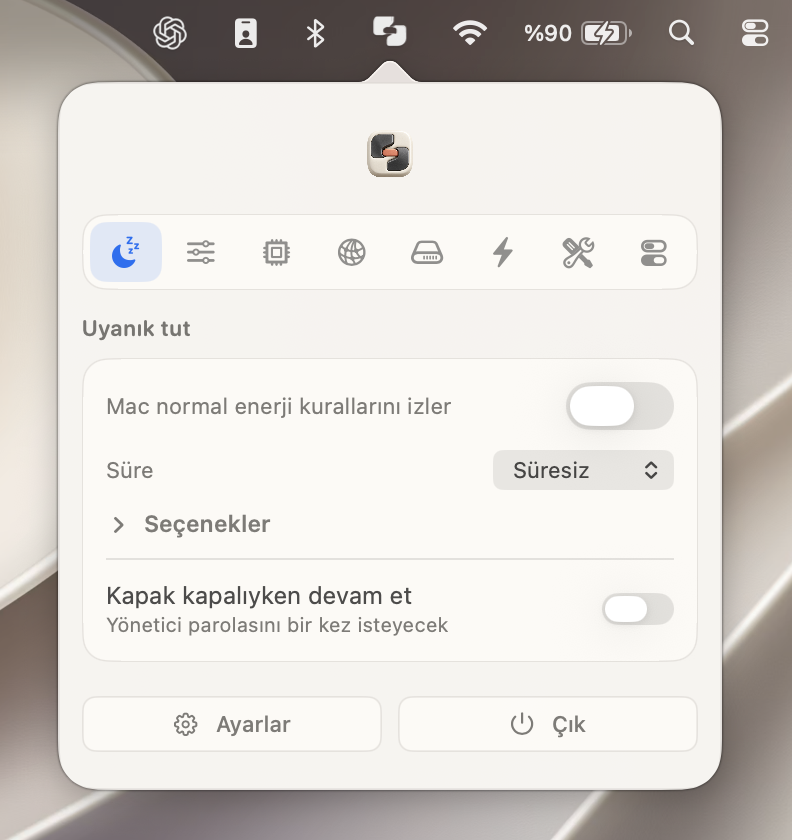
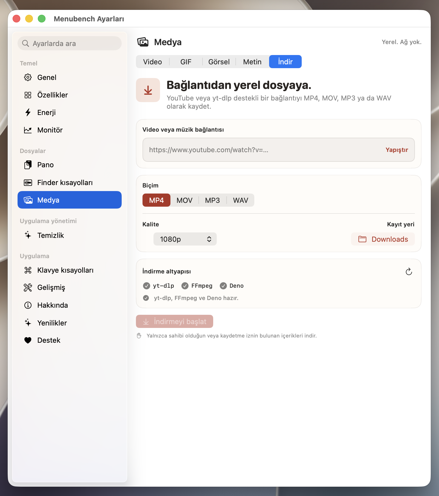
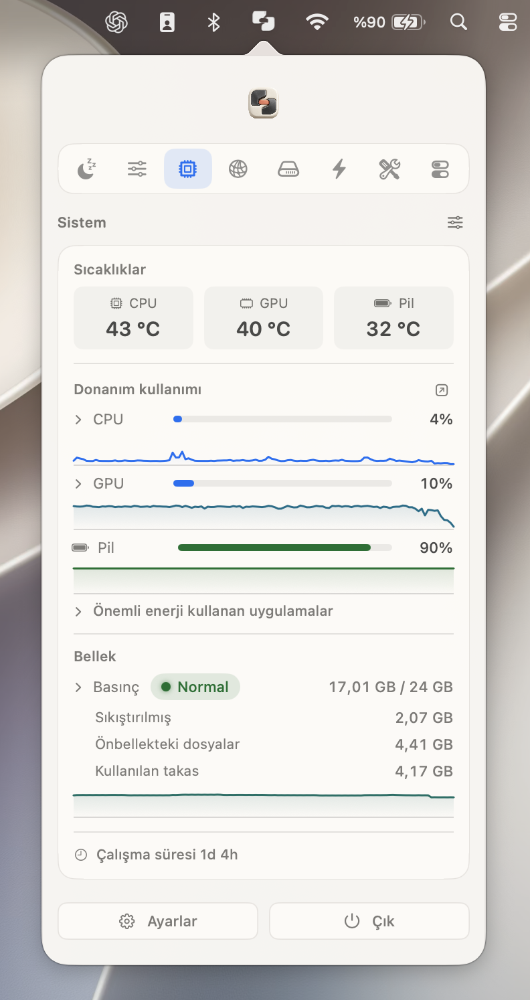
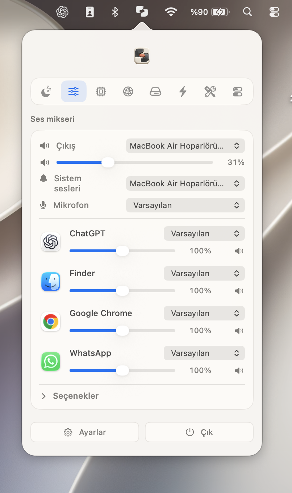
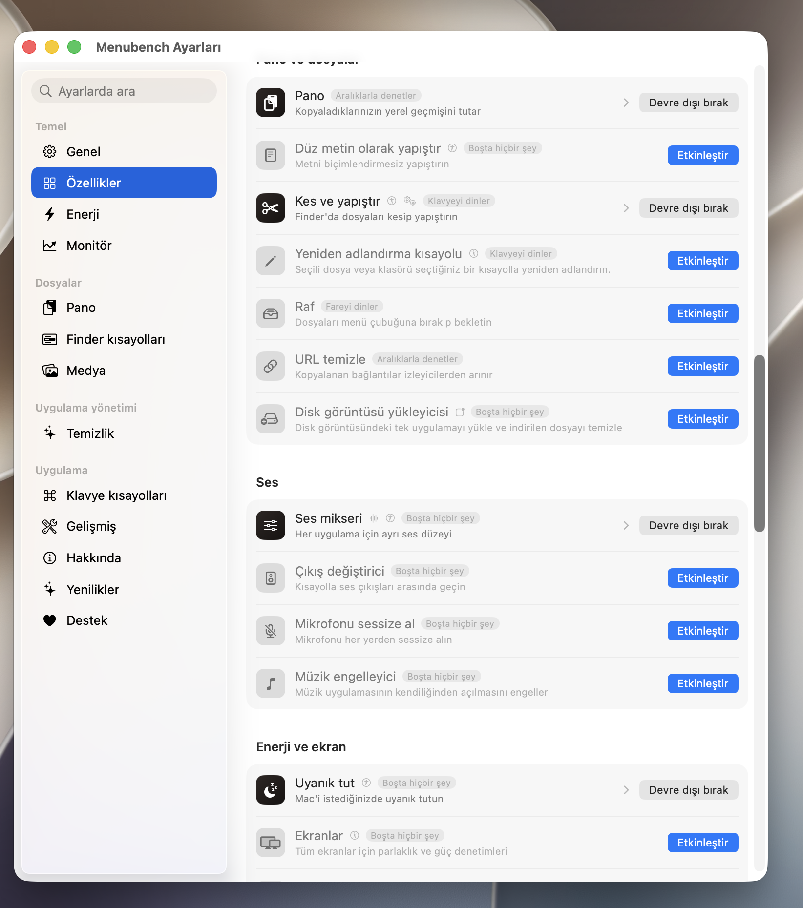
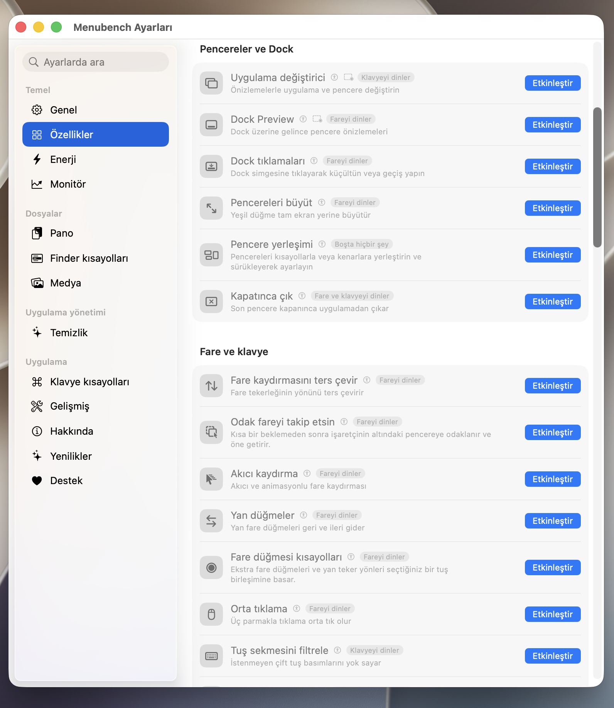

<p align="center">
  
</p>

<h1 align="center">Menubench</h1>

<p align="center">
  <strong>A calm, local-first workbench for macOS.</strong><br>
  Günlük Mac araçları, tek ve sade bir menü çubuğu uygulamasında.
</p>

<p align="center">
  System readings, media downloads, window controls, audio tools and more—ready when you need them.<br>
  Sistem ölçümleri, medya indirme, pencere yönetimi, ses araçları ve daha fazlası—ihtiyacınız olduğunda hazır.
</p>

<p align="center">
  <a href="https://github.com/augrclk/menubench/releases/latest/download/Menubench.dmg"><strong>Download Menubench</strong></a>
  &nbsp;·&nbsp;
  <a href="#homebrew">Homebrew</a>
  &nbsp;·&nbsp;
  <a href="docs/PRIVACY.md">Privacy</a>
  &nbsp;·&nbsp;
  <a href="#turkce">Türkçe</a>
</p>

<p align="center"><sub>macOS 14 Sonoma or newer · Apple silicon and Intel · GPL-3.0-or-later</sub></p>

<br>

<p align="center">
  <a href="docs/assets/readme/menubench-keep-awake.png">
    
  </a>
</p>

## Product tour · Ürün turu

### From a link to a local file · Bağlantıdan yerel dosyaya

Paste a supported link, choose MP4, MOV, MP3 or WAV, select the quality and save it directly to your Mac. Processing runs locally with `yt-dlp` and FFmpeg.

Desteklenen bağlantıyı yapıştırın; MP4, MOV, MP3 veya WAV biçimini ve kaliteyi seçin; dosyayı doğrudan Mac’inize kaydedin. İşlem `yt-dlp` ve FFmpeg ile yerel olarak çalışır.

<p align="center">
  <a href="docs/assets/readme/menubench-media-download.png">
    
  </a>
</p>

### Your Mac at a glance · Mac’iniz tek bakışta

See current CPU and GPU activity, memory pressure, battery state and available temperature readings. Adjust app volume or audio output without leaving the menu bar.

CPU ve GPU kullanımını, bellek basıncını, pil durumunu ve mevcut sıcaklık verilerini görün. Uygulama sesini veya çıkışını menü çubuğundan ayarlayın.

<table>
  <tr>
    <td width="50%" align="center" valign="top">
      <a href="docs/assets/readme/menubench-system.png">
        
      </a>
    </td>
    <td width="50%" align="center" valign="top">
      <a href="docs/assets/readme/menubench-audio-mixer.png">
        
      </a>
    </td>
  </tr>
</table>

### One app, only the tools you choose · Tek uygulama, yalnızca seçtiğiniz araçlar

Every module ships with Menubench. **Enable** does not download anything; it only makes that tool visible and allows it to run. Disable a tool to remove it from the interface and stop its background work.

Tüm modüller Menubench ile birlikte gelir. **Etkinleştir** düğmesi hiçbir şey indirmez; yalnızca ilgili aracı görünür ve çalışır hâle getirir. Devre dışı bıraktığınız araç arayüzden kaldırılır ve arka plan çalışması durur.

<table>
  <tr>
    <td width="50%" align="center" valign="top">
      <a href="docs/assets/readme/menubench-feature-library.png">
        
      </a>
    </td>
    <td width="50%" align="center" valign="top">
      <a href="docs/assets/readme/menubench-window-tools.png">
        
      </a>
    </td>
  </tr>
</table>

> The screenshots above are the original, full-resolution product captures. Click any image to open it at its native resolution.
>
> Yukarıdaki görseller, ürünün orijinal tam çözünürlüklü ekran görüntüleridir. Doğal çözünürlükte açmak için görsele tıklayın.

---

<a id="english"></a>

## English

Menubench keeps frequently used Mac controls behind one menu bar icon. Start with a quiet system panel and keep-awake switch, then enable only the modules that earn their place.

| Area | Included tools |
|---|---|
| **Monitor** | CPU, GPU, memory, disk, network traffic, battery, available temperature and fan readings, plus history graphs. |
| **Windows** | Window layouts, a visual app switcher, Dock previews, focus helpers and configurable shortcuts. |
| **Media** | Link downloads, local video conversion, GIF creation, image tools, OCR, screenshots and screen recording. |
| **Audio** | Per-app volume, output routing, device switching, input pinning and global microphone mute. |
| **Files** | Clipboard history, snippets, a temporary shelf, Finder cut-and-paste, DMG installation and app cleanup. |
| **Menu bar** | Reorderable sections, optional live readings, compact controls and independent appearance settings. |

### Link downloads, built in

The downloader accepts YouTube and other `yt-dlp`-supported links. `yt-dlp`, FFmpeg and Deno run locally, and the URL is passed as a direct process argument rather than through a shell. Download only media you own or have permission to save.

### Install

Download [Menubench.dmg](https://github.com/augrclk/menubench/releases/latest/download/Menubench.dmg), open it and drag **Menubench** to **Applications**. Public releases are signed with an Apple Developer ID, notarized by Apple and stapled for offline verification.

<a id="homebrew"></a>

#### Homebrew

This repository is also a Homebrew tap. Its Cask installs Menubench together with the downloader dependencies.

```sh
brew tap augrclk/menubench https://github.com/augrclk/menubench
brew install --cask augrclk/menubench/menubench
```

Update or remove it later:

```sh
brew upgrade --cask augrclk/menubench/menubench
brew uninstall --cask menubench
```

### Private by default

Menubench has no account, advertising, analytics or telemetry. Most tools stay entirely on your Mac. Network access occurs only when an action you choose requires it—for example a media download, Homebrew action or update check.

Permissions are requested per feature and remain optional. See [Privacy](docs/PRIVACY.md) and [Permissions](docs/PERMISSIONS.md) for complete details.

### Build with Xcode

Open [Menubench.xcodeproj](Menubench.xcodeproj), select your Development Team and run the shared **Menubench** scheme. The Release configuration produces a universal Apple silicon and Intel app.

```sh
git clone https://github.com/augrclk/menubench.git
cd menubench
brew install yt-dlp ffmpeg deno
./build.sh --dev
./build/MenubenchDeveloper --selftest
./build.sh --test
```

Signing, notarization and DMG publishing are documented in [DISTRIBUTION.md](DISTRIBUTION.md).

---

<a id="turkce"></a>

## Türkçe

Menubench, sık kullandığınız Mac araçlarını tek bir menü çubuğu simgesinde toplar. Sade sistem paneli ve uyanık tutma aracıyla başlayabilir; yalnızca işinize yarayan modülleri etkinleştirebilirsiniz.

| Alan | Dahil olan araçlar |
|---|---|
| **Monitör** | CPU, GPU, bellek, disk, ağ trafiği, pil, mevcut sıcaklık ve fan verileri ile geçmiş grafikleri. |
| **Pencereler** | Pencere yerleşimleri, görsel uygulama değiştirici, Dock önizlemeleri, odak yardımcıları ve ayarlanabilir kısayollar. |
| **Medya** | Bağlantıdan indirme, yerel video dönüştürme, GIF oluşturma, görsel araçları, OCR, ekran görüntüsü ve ekran kaydı. |
| **Ses** | Uygulama bazında ses seviyesi, çıkış yönlendirme, aygıt değiştirme, giriş sabitleme ve genel mikrofon susturma. |
| **Dosyalar** | Pano geçmişi, metin parçaları, geçici raf, Finder’da kes-yapıştır, DMG kurulumu ve uygulama temizleme. |
| **Menü çubuğu** | Sıralanabilir bölümler, isteğe bağlı canlı ölçümler, kompakt denetimler ve bağımsız görünüm ayarları. |

### Bağlantıdan video veya müzik indirme

İndirici; YouTube ve `yt-dlp` tarafından desteklenen diğer bağlantıları kabul eder. Video için MP4 veya MOV, ses için MP3 veya WAV seçebilir; kaliteyi belirleyip dosyayı istediğiniz klasöre kaydedebilirsiniz. `yt-dlp`, FFmpeg ve Deno yerel olarak çalışır. Yalnızca sahibi olduğunuz veya kaydetme izniniz bulunan içerikleri indirin.

### Kurulum

[Menubench.dmg dosyasını indirin](https://github.com/augrclk/menubench/releases/latest/download/Menubench.dmg), açın ve **Menubench** uygulamasını **Applications / Uygulamalar** klasörüne sürükleyin. Yayımlanan sürümler Apple Developer ID ile imzalanır, Apple tarafından noterlenir ve çevrimdışı doğrulama için noter kaydı uygulamaya işlenir.

Homebrew ile kurmak için:

```sh
brew tap augrclk/menubench https://github.com/augrclk/menubench
brew install --cask augrclk/menubench/menubench
```

Güncellemek veya kaldırmak için:

```sh
brew upgrade --cask augrclk/menubench/menubench
brew uninstall --cask menubench
```

### Öncelik gizlilikte

Menubench hesap, reklam, analiz veya telemetri içermez. Araçların çoğu tamamen Mac’inizde çalışır. Ağ erişimi yalnızca seçtiğiniz işlem gerektirdiğinde kullanılır; örneğin medya indirme, Homebrew işlemi veya güncelleme denetimi sırasında.

İzinler özellik bazında istenir ve isteğe bağlı kalır. Ayrıntılar için [Gizlilik](docs/PRIVACY.md) ve [İzinler](docs/PERMISSIONS.md) belgelerine bakın.

### Xcode ile derleme

[Menubench.xcodeproj](Menubench.xcodeproj) dosyasını açın, kendi Development Team hesabınızı seçin ve ortak **Menubench** şemasını çalıştırın. Release yapılandırması Apple silicon ve Intel için evrensel uygulama üretir.

Komut satırından geliştirme derlemesi:

```sh
git clone https://github.com/augrclk/menubench.git
cd menubench
brew install yt-dlp ffmpeg deno
./build.sh --dev
./build/MenubenchDeveloper --selftest
./build.sh --test
```

İmzalama, noterleme ve DMG yayımlama adımları [DISTRIBUTION.md](DISTRIBUTION.md) belgesinde yer alır.

## Contributing · Katkı

Focused fixes, thoughtful new tools and translations are welcome. Read [CONTRIBUTING.md](CONTRIBUTING.md), then open an issue with the macOS version and hardware used for testing.

Odaklı hata düzeltmeleri, düşünülmüş yeni araçlar ve çeviriler kabul edilir. [CONTRIBUTING.md](CONTRIBUTING.md) belgesini okuyup testte kullandığınız macOS sürümü ve donanımla birlikte bir sorun kaydı açabilirsiniz.

## License and attribution · Lisans ve atıf

Menubench is distributed under [GPL-3.0-or-later](LICENSE). Retained upstream copyright and third-party notices are recorded in [NOTICE](NOTICE). The Menubench name and visual identity are covered separately by [TRADEMARKS.md](TRADEMARKS.md).

Menubench, [GPL-3.0-or-later](LICENSE) lisansı altında dağıtılır. Korunması gereken kaynak proje telifleri ve üçüncü taraf bildirimleri [NOTICE](NOTICE) dosyasındadır. Menubench adı ve görsel kimliği ayrıca [TRADEMARKS.md](TRADEMARKS.md) kapsamında korunur.

© 2026 Arif Uğur Çelik
